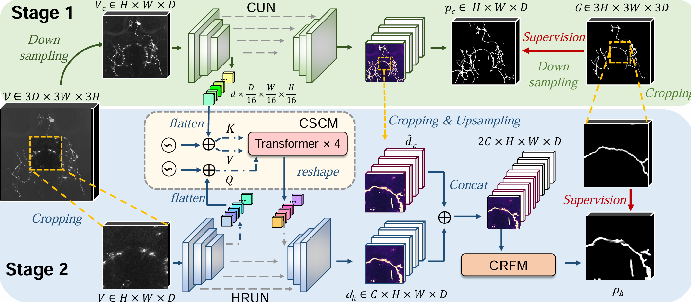

# GBP-Net
This is the code of TMI 2025 Paper “Glancing Beyond Patch: Spatial Contextual Cues for 3D Neuron Segmentation”.


## Overview

Accurate segmentation of neurons in 3D fluorescence microscopy images is essential for advancing neuroscience. Prevalent methods split a volume into patches and process each patch separately due to computational resource limitations. However, they fail to capture global neuronal morphology across multiple patches, which results in discontinuous segmentation and poses a challenge for subsequent neuronal reconstruction. 
In this paper, we propose a dual U-Net architecture termed ``Glancing Beyond Patch'' Network (GBP-Net) to incorporate contextual information into segmentation.


*The architecture of ``Glancing Beyond Patch'' Network*

## Installation

Our code is based on PyTorch connectomics: https://github.com/zudi-lin/pytorch_connectomics

```bash
conda env create -f environment.yaml
```

## The Train of GBP-Net
1.Refer to the configuration of C.yaml to train CUN in the original pytc framework and save the model weights as CUN.ckpt. 

2.Replace the original 'connectomics' folder with the one provided in the repository

3.Then load the weights of CUN and train HRUN:
```bash
python -u scripts/main.py --config-file C.yaml  --checkpoint ".../CUN.pth.tar" 
```

For inference:
```bash
python -u scripts/main.py --config-file C.yaml --inference --checkpoint ".../GBPNet.pth.tar" 
```

You can easily modify the configuration in the yaml file.

## Dataset
Due to the large size of tif images, for convenience, we save the images and annotation data as h5 files.
When training your data, only make modifications in Function 'build' in
connectomics/data/dataset/build.py

We have also uploaded a sample image from our ZBFWB dataset.
For more information about the zbfwb dataset, please refer to X. Du, Z. Yue, J. Wei, W. Li, M. Chen, T. Chen, H. Hu, H. Ren, Z. Jia, X. Ning et al., “Central nervous system atlas of larval zebrafish constructed using the morphology of single excitatory and inhibitory neurons,” bioRxiv, pp. 2025–06, 2025.
